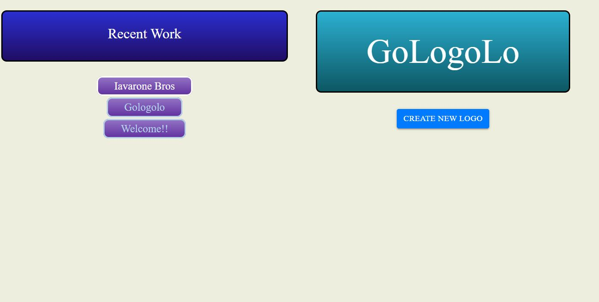
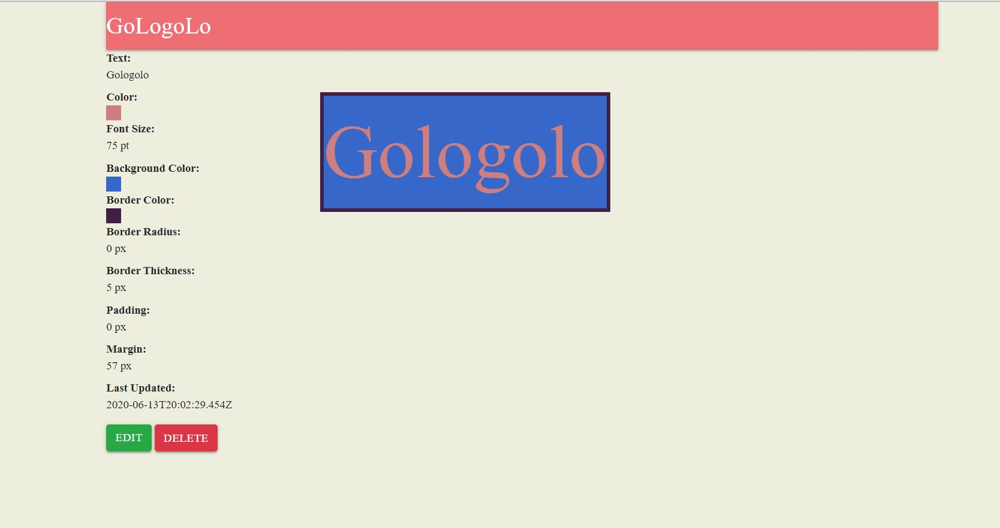
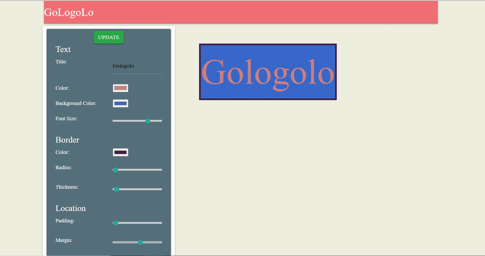

# Logo Maker
Logo maker CRUD app

## Experience
Users can create, design, edit, and delete logos.

### Home page

### View page

### Edit and Create page

# Technical
## Views
- Home page
- View logo
- Edit logo
- Create logo

## Features
- Sidebar allows for designing to create/edit the logo
- Logos ordered by most recently edited

## Languages
#### Front-End
* HTML
* CSS
* JavaScript
* React-materialize
* Bootstrap

#### Back-End
* Node.js
* Express
* Mongoose
* GraphQL
* MongoDB

## Planning
- Week One
  - April 11, 2020
    - home page, create logo, backend setup
  - April 12, 2020
    - edit logo, view logo, polish UI and foolproof design
